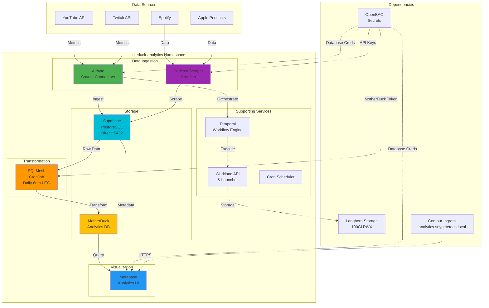

# Pedro Ops Cluster Architecture

Comprehensive architecture documentation for the pedro-ops Kubernetes cluster.

## Overview

Pedro Ops is a production-ready 3-node Kubernetes cluster built with Foundry CLI, designed to host AI workloads and provide secure connectivity to external GPU inference machines via Tailscale.

## Infrastructure Topology

### Physical Layer

```
┌─────────────────────────────────────────────────────────────┐
│                     Physical Network                         │
│                  (100.x.x.x IP Range)                       │
└─────────────────────────────────────────────────────────────┘
         │                  │                  │
    ┌────▼────┐       ┌────▼────┐       ┌────▼────┐
    │Control  │       │Worker 1 │       │Worker 2 │
    │ Plane   │       │         │       │         │
    │         │       │  +2TB   │       │         │
    │.81.89.62│       │.70.90.12│       │.125.196.1│
    └─────────┘       └─────────┘       └─────────┘
```

### Node Specifications

| Node | IP | Role | Resources | Special |
|------|----|------|-----------|---------|
| control-plane | 100.81.89.62 | Control plane + infra | 4+ cores, 8GB+ RAM | Runs OpenBAO, PowerDNS, Zot |
| worker-1 | 100.70.90.12 | Worker | 4+ cores, 8GB+ RAM | **2TB storage backend** |
| worker-2 | 100.125.196.1 | Worker | 4+ cores, 8GB+ RAM | - |
| **VIP** | **100.81.89.100** | K8s API | N/A | Virtual IP for HA |

## Software Stack

### Core Kubernetes Layer

```
┌─────────────────────────────────────────────────────────┐
│                    K3s (Kubernetes)                      │
│                      v1.28.x+k3s1                        │
├─────────────────────────────────────────────────────────┤
│  • Lightweight Kubernetes distribution                  │
│  • Control Plane: 100.81.89.62                          │
│  • Workers: 100.70.90.12, 100.125.196.1                 │
│  • API Server: https://100.81.89.100:6443               │
└─────────────────────────────────────────────────────────┘
```

### Infrastructure Services

Deployed and managed by Foundry:

#### 1. OpenBAO (Secrets Management)
- **Namespace:** `openbao-system`
- **Purpose:** Secrets management (HashiCorp Vault fork)
- **Storage:** 50Gi on 2TB drive
- **Location:** Control plane node

#### 2. PowerDNS (Internal DNS)
- **Namespace:** `powerdns-system`
- **Purpose:** Internal DNS for cluster services
- **Domain:** `soypetetech.local`
- **Location:** Control plane node

#### 3. Zot (Container Registry)
- **Namespace:** `zot-system`
- **Purpose:** OCI-compliant container registry
- **Storage:** 100Gi Longhorn volume
- **Location:** Control plane node

#### 4. Contour (Ingress)
- **Namespace:** `projectcontour`
- **Purpose:** Gateway API controller / Ingress
- **Type:** Envoy-based proxy
- **Location:** All nodes

#### 5. Cert-Manager
- **Namespace:** `cert-manager`
- **Purpose:** Automated TLS certificate management
- **Issuers:** Let's Encrypt, self-signed
- **Location:** Control plane

### Storage Layer

```
┌──────────────────────────────────────────────────────────┐
│               2TB Physical Drive (Worker-1)               │
│             /data/persistent-storage/                     │
├──────────────────────────────────────────────────────────┤
│  • openbao/     (50Gi)  - Secrets                        │
│  • prometheus/  (200Gi) - Metrics (15d retention)        │
│  • loki/        (100Gi) - Logs (7d retention)            │
│  • grafana/     (10Gi)  - Dashboards                     │
│  • longhorn/    (auto)  - Distributed storage base       │
└──────────────────────────────────────────────────────────┘
                            │
                            ▼
┌──────────────────────────────────────────────────────────┐
│              Longhorn Distributed Storage                 │
│                  (2 replicas across workers)              │
├──────────────────────────────────────────────────────────┤
│  • Default StorageClass: longhorn                        │
│  • Replication: 2 replicas                               │
│  • Backend: /data/persistent-storage/longhorn            │
│  • S3 Backup: SeaweedFS integration                      │
└──────────────────────────────────────────────────────────┘
                            │
                            ▼
┌──────────────────────────────────────────────────────────┐
│                  SeaweedFS (S3 Storage)                   │
│                        500Gi                              │
├──────────────────────────────────────────────────────────┤
│  • S3-compatible object storage                          │
│  • Backup destination for Velero                         │
│  • Longhorn snapshot storage                             │
└──────────────────────────────────────────────────────────┘
```

### Observability Stack

```
┌─────────────────────────────────────────────────────────┐
│                    Prometheus                            │
│                  (Metrics Collection)                    │
│                200Gi on 2TB drive, 15d retention         │
├─────────────────────────────────────────────────────────┤
│  • Prometheus Operator                                  │
│  • ServiceMonitors for auto-discovery                   │
│  • Alertmanager for notifications                       │
│  • Remote write to external systems (optional)          │
└─────────────────────────────────────────────────────────┘
                            │
                            ▼
┌─────────────────────────────────────────────────────────┐
│                       Loki                               │
│                 (Log Aggregation)                        │
│               100Gi on 2TB drive, 7d retention           │
├─────────────────────────────────────────────────────────┤
│  • Promtail for log collection                          │
│  • LogQL query language                                 │
│  • Compaction and retention management                  │
└─────────────────────────────────────────────────────────┘
                            │
                            ▼
┌─────────────────────────────────────────────────────────┐
│                     Grafana                              │
│                 (Visualization)                          │
│                10Gi on 2TB drive                         │
├─────────────────────────────────────────────────────────┤
│  • Pre-configured dashboards                            │
│  • Datasources: Prometheus, Loki                        │
│  • Alerting and notifications                           │
│  • User management and RBAC                             │
└─────────────────────────────────────────────────────────┘
```

### Analytics Stack



**Components:**

#### Airbyte (Data Ingestion)
- **Namespace:** `eleduck-analytics`
- **Purpose:** Ingest data from external sources (YouTube, Twitch, Spotify, Apple Podcasts)
- **Database:** Supabase PostgreSQL (direct connection on port 5432 for prepared statement support)
- **Storage:** 100Gi Longhorn RWX volume for logs and state
- **Components:**
  - Bootloader: Initializes databases and seeds 642 connector definitions (~7 min startup)
  - Server: Main API and orchestration (port 8001)
  - Worker: Executes connector tasks
  - Temporal: Workflow engine for task orchestration
  - Workload API/Launcher: Manages connector workload execution
  - Cron: Scheduled job execution

**Important**: Airbyte requires PostgreSQL prepared statements, so it uses direct connection (port 5432) instead of Supabase pooler (port 6543).

#### Metabase (Analytics Dashboard)
- **Namespace:** `eleduck-analytics`
- **Purpose:** Business intelligence and data visualization
- **Database:** Supabase PostgreSQL pooler (port 6543) for application metadata
- **Analytics Database:** MotherDuck for querying transformed data
- **Storage:** 10Gi Longhorn volume for Metabase data
- **Access:** https://analytics.soypetetech.local (via Contour ingress)
- **Image:** metabase/metabase:latest

#### SQLMesh (Data Transformation)
- **Namespace:** `eleduck-analytics`
- **Purpose:** SQL-based data transformation and modeling
- **Schedule:** CronJob runs daily at 6:00 AM UTC
- **Source:** Raw data from Supabase
- **Destination:** Transformed data to MotherDuck analytics database
- **Image:** Custom-built from Zot registry (100.81.89.62:5000/eleduck/sqlmesh:latest)

#### Podcast Scraper
- **Namespace:** `eleduck-analytics`
- **Purpose:** Automated podcast metrics collection
- **Schedule:** CronJob runs daily at 2:00 AM UTC
- **Sources:** Apple Podcasts, Spotify, Amazon Music, YouTube
- **Database:** Supabase (analytics database)
- **Credentials:** Stored in OpenBAO, synced from 1Password
- **Image:** Custom-built from Zot registry (100.81.89.62:5000/eleduck/podcast-scraper:latest)

**Data Flow:**
1. **Ingestion**: Airbyte connectors pull data from external APIs → Supabase raw tables
2. **Scraping**: Podcast scraper collects metrics → Supabase analytics table
3. **Transformation**: SQLMesh transforms raw data → MotherDuck analytics database
4. **Visualization**: Metabase queries MotherDuck → Displays dashboards and reports

**Storage Requirements:**
- Airbyte: 100Gi RWX (requires nfs-common on all nodes)
- Metabase: 10Gi RWO
- Total: ~110Gi on Longhorn

**Secrets Management:**
- Source: 1Password (vault: pedro)
- Sync: `scripts/sync-secrets-to-openbao.sh` syncs to OpenBAO
- K8s Secrets: `scripts/create-secrets-from-openbao.sh` creates secrets before Helm deployment
- Keys: DATABASE_USER, DATABASE_PASSWORD, motherduck token, podcast API credentials

**Known Issues:**
- **Supabase Pooler**: Uses PgBouncer in transaction mode, which doesn't support prepared statements
- **Solution**: Airbyte uses direct connection (5432), Metabase uses pooler (6543)
- **NFS Requirement**: Longhorn RWX volumes require nfs-common installed on all nodes

## Network Architecture

### Internal Networking

```
┌─────────────────────────────────────────────────────────┐
│                  Cluster Network (CNI)                   │
│                   Flannel (default)                      │
├─────────────────────────────────────────────────────────┤
│  • Pod CIDR: 10.42.0.0/16                               │
│  • Service CIDR: 10.43.0.0/16                           │
│  • VXLAN overlay network                                │
└─────────────────────────────────────────────────────────┘
                            │
                            ▼
┌─────────────────────────────────────────────────────────┐
│              Internal DNS (PowerDNS)                     │
│                 soypetetech.local                        │
├─────────────────────────────────────────────────────────┤
│  • Cluster service discovery                            │
│  • Custom internal domains                              │
│  • Integration with CoreDNS                             │
└─────────────────────────────────────────────────────────┘
```

### External Connectivity

```
┌─────────────────────────────────────────────────────────┐
│              Tailscale VPN (WireGuard)                   │
│                                                          │
│  ┌────────────┐         ┌────────────┐                 │
│  │  Cluster   │         │    GPU     │                 │
│  │  Nodes     │◄───────►│  Machine   │                 │
│  │ (Operator) │         │            │                 │
│  └────────────┘         └────────────┘                 │
│       │                                                 │
│       │ Magic DNS: *.ts.net                             │
│       │ ACL: tag:k8s-pedro-ops ↔ tag:gpu-inference     │
│       │                                                 │
└─────────────────────────────────────────────────────────┘
                            │
                            ▼
┌─────────────────────────────────────────────────────────┐
│                Split DNS Configuration                   │
├─────────────────────────────────────────────────────────┤
│  • *.soypetetech.local → PowerDNS (internal)            │
│  • *.ts.net → Tailscale Nameserver (external)           │
│  • CoreDNS forwards based on domain                     │
└─────────────────────────────────────────────────────────┘
```

### Ingress Architecture

```
                         Internet
                            │
                            ▼
┌─────────────────────────────────────────────────────────┐
│               Contour Ingress Controller                 │
│                  (Gateway API)                           │
├─────────────────────────────────────────────────────────┤
│  • HTTPRoute / TLSRoute resources                       │
│  • Automatic TLS via cert-manager                       │
│  • Envoy proxy for L7 routing                           │
└─────────────────────────────────────────────────────────┘
                            │
                            ▼
              ┌─────────────┼─────────────┐
              │             │             │
              ▼             ▼             ▼
         Service A      Service B    Service C
       (pedro-ops ns) (monitoring)  (custom app)
```

## Security Architecture

### Authentication & Authorization

```
┌─────────────────────────────────────────────────────────┐
│                   Tailscale ACLs                         │
├─────────────────────────────────────────────────────────┤
│  • tag:k8s-operator (operator itself)                   │
│  • tag:k8s-pedro-ops (cluster resources)                │
│  • tag:gpu-inference (external GPU machine)             │
│  • Network policy enforcement                           │
└─────────────────────────────────────────────────────────┘
                            │
                            ▼
┌─────────────────────────────────────────────────────────┐
│                Kubernetes RBAC                           │
├─────────────────────────────────────────────────────────┤
│  • Role-based access control                            │
│  • ServiceAccounts for pod identity                     │
│  • ClusterRoles and RoleBindings                        │
└─────────────────────────────────────────────────────────┘
                            │
                            ▼
┌─────────────────────────────────────────────────────────┐
│              OpenBAO (Secrets Management)                │
├─────────────────────────────────────────────────────────┤
│  • API keys and credentials                             │
│  • SSH keys                                             │
│  • TLS certificates                                     │
│  • Dynamic secrets                                      │
└─────────────────────────────────────────────────────────┘
```

### Network Security

- **Tailscale VPN:** All external connectivity through encrypted WireGuard tunnels
- **Network Policies:** Kubernetes NetworkPolicies for pod-to-pod communication
- **TLS Everywhere:** cert-manager for automatic certificate management
- **Pod Security:** Pod Security Standards enforced

## Data Flow Diagrams

### Application Request Flow

```
┌──────────┐
│  User    │
└────┬─────┘
     │
     │ HTTPS
     ▼
┌────────────────┐
│    Contour     │ (Ingress)
│    (Envoy)     │
└────┬───────────┘
     │
     │ HTTP (internal)
     ▼
┌────────────────┐
│   Service      │
└────┬───────────┘
     │
     │ Load balance
     ▼
┌────────────────┐
│     Pods       │ (Application)
│  (ReplicaSet)  │
└────┬───────────┘
     │
     │ (optional)
     ▼
┌────────────────┐
│  GPU Machine   │ (via Tailscale)
│ (Inference)    │
└────────────────┘
```

### Monitoring Data Flow

```
┌────────────────┐
│  Application   │
│     Pods       │
└────┬───────────┘
     │
     │ /metrics endpoint
     ▼
┌────────────────┐
│  Prometheus    │
│ (scrape every  │
│   30s)         │
└────┬───────────┘
     │
     │ Store (15d retention)
     │ 200Gi on 2TB drive
     ▼
┌────────────────┐
│   Grafana      │
│  (Dashboard)   │
└────────────────┘

┌────────────────┐
│  Application   │
│     Pods       │
└────┬───────────┘
     │
     │ stdout/stderr
     ▼
┌────────────────┐
│   Promtail     │
│ (log collector)│
└────┬───────────┘
     │
     │ Push logs
     ▼
┌────────────────┐
│      Loki      │
│ (store 7d)     │
│ 100Gi on 2TB   │
└────┬───────────┘
     │
     │ Query (LogQL)
     ▼
┌────────────────┐
│   Grafana      │
│   (Explore)    │
└────────────────┘
```

## High Availability Considerations

### Current Setup
- **Nodes:** 3 nodes (1 control plane, 2 workers)
- **Control Plane:** Single node (NOT HA)
- **Workers:** 2 nodes for workload distribution
- **Storage:** Longhorn with 2 replicas for data redundancy

### Limitations
- Single control plane is a single point of failure
- If control plane goes down:
  - Existing workloads continue running
  - No new deployments or changes possible
  - Kubernetes API unavailable

### Future HA Improvements
To achieve full HA:
1. Add 2 more control plane nodes (total 3)
2. Configure etcd cluster across all control planes
3. Use VIP for control plane load balancing
4. Add anti-affinity rules for critical pods

## Disaster Recovery

### Backup Strategy

```
┌────────────────┐
│  Velero        │ (Backup operator)
└────┬───────────┘
     │
     │ Schedule: daily
     ▼
┌────────────────┐
│  SeaweedFS     │ (S3 storage)
│  500Gi         │
└────┬───────────┘
     │
     │ Backup includes:
     │ • Kubernetes resources
     │ • PersistentVolume data
     │ • Cluster configuration
     ▼
┌────────────────┐
│  External S3   │ (optional)
│  (off-site)    │
└────────────────┘
```

### Recovery Procedures

1. **Single Pod Failure:** Automatic restart by Kubernetes
2. **Node Failure:** Pods rescheduled to healthy nodes
3. **Control Plane Failure:** Manual intervention required (restore from backup)
4. **Data Loss:** Restore from Velero backup

## Performance Characteristics

### Expected Metrics

- **API Latency:** <100ms for cluster operations
- **Pod Startup:** 5-30 seconds depending on image size
- **Storage I/O:** Limited by 2TB drive performance
- **Network:** VXLAN overhead ~5-10%

### Resource Allocation

| Component | CPU | Memory | Storage |
|-----------|-----|--------|---------|
| K3s (control plane) | 1-2 cores | 2-4GB | 20GB |
| K3s (worker) | 0.5-1 core | 1-2GB | 10GB |
| Prometheus | 1-2 cores | 4-8GB | 200GB |
| Loki | 0.5-1 core | 2-4GB | 100GB |
| Grafana | 0.2-0.5 core | 512MB-1GB | 10GB |
| Longhorn | 0.5 core/node | 1GB/node | Variable |

## Scaling Considerations

### Horizontal Scaling
- Add more worker nodes for compute capacity
- Increase Longhorn replicas for storage redundancy
- Scale application pods with HPA (Horizontal Pod Autoscaler)

### Vertical Scaling
- Increase node resources (CPU, RAM)
- Expand 2TB drive or add more drives
- Adjust Prometheus/Loki retention policies

### Limitations
- Storage backend tied to Worker-1 (single 2TB drive)
- Network bandwidth limited by physical network
- Control plane is not HA (single node)

## Technology Decisions

### Why K3s?
- Lightweight and production-ready
- Full Kubernetes compatibility
- Low resource overhead
- Easy to deploy and manage

### Why Foundry?
- All-in-one deployment tool
- Consistent configuration
- Integrated observability stack
- Battle-tested component selection

### Why Tailscale?
- Zero-config VPN
- Easy to set up and manage
- Secure by default (WireGuard)
- Magic DNS for easy service discovery

### Why Longhorn?
- Cloud-native distributed storage
- Kubernetes-native
- Snapshot and backup capabilities
- Good performance for block storage

## References

- [K3s Architecture](https://docs.k3s.io/architecture)
- [Foundry Design](https://github.com/catalystcommunity/foundry)
- [Longhorn Architecture](https://longhorn.io/docs/latest/concepts/)
- [Tailscale How It Works](https://tailscale.com/blog/how-tailscale-works/)
