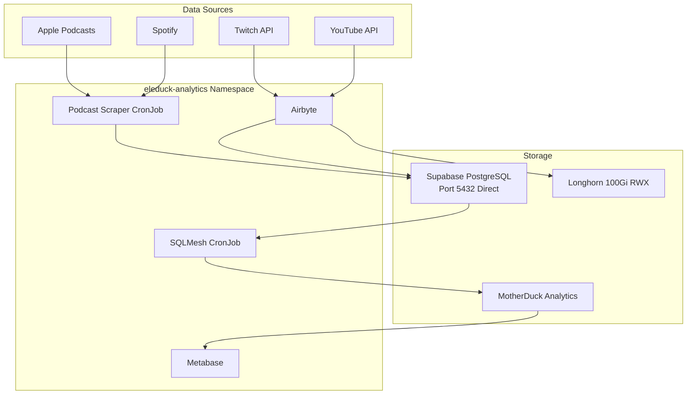

# Eleduck Analytics Stack Deployment

**Date:** February 15, 2026
**Cluster:** pedro-ops (3-node K3s via Foundry)
**Status:** Partially Deployed (6/8 components running)

## Overview

Deployment of the eleduck-analytics stack (Airbyte, Metabase, SQLMesh, Podcast Scraper) to the pedro-ops Kubernetes cluster.

## Architecture



## Technical Challenges Resolved

### 1. Supabase Pooler Prepared Statement Issue

**Problem:** Airbyte bootloader failed with "prepared statement S_1 already exists" error.

**Root Cause:** Supabase connection pooler (PgBouncer in transaction mode) doesn't support PostgreSQL prepared statements required by Airbyte's JOOQ library.

**Solution:** Use direct database connection (port 5432) instead of pooler (port 6543) for all services.

**Configuration:**
```yaml
global:
  database:
    host: aws-0-us-west-1.pooler.supabase.com
    port: 5432  # Direct connection, not pooler
    sslMode: require
```

### 2. Longhorn RWX Volume Mount Failures

**Problem:** Airbyte server, worker, and workload-launcher pods stuck in `ContainerCreating` with NFS mount errors.

**Root Cause:** Longhorn's ReadWriteMany (RWX) volumes use NFS under the hood, which requires `nfs-common` package installed on all cluster nodes.

**Solution:** Install NFS client utilities on all nodes:
```bash
for host in 100.81.89.62 100.70.90.12 100.125.196.1; do
  ssh root@$host 'apt-get update && apt-get install -y nfs-common'
done
```

**Verification:**
```bash
ssh root@<node-ip> 'which mount.nfs'
```

### 3. DNS Resolution Failures

**Problem:** Application pods (Temporal, Metabase) failed with `UnknownHostException` or `bad address` errors when resolving `aws-0-us-west-1.pooler.supabase.com`, while test pods (busybox) could resolve it successfully.

**Root Cause:** Some container images (Java-based apps, certain utilities) have DNS resolution issues with CoreDNS forwarding.

**Solution:** Add `hostAliases` to pod specifications to bypass DNS:

```yaml
# For Metabase (in deployment template)
spec:
  hostAliases:
    - ip: "52.8.172.168"  # Obtained via: dig +short hostname @8.8.8.8
      hostnames:
        - "aws-0-us-west-1.pooler.supabase.com"
```

**For Airbyte components:** Requires patching the compressed Helm chart or using kubectl patch.

## Deployment Steps

### 1. Secrets Management

Secrets are synced from 1Password to OpenBAO, then created as Kubernetes secrets:

```bash
# Sync from 1Password to OpenBAO
cd /Users/miriahpeterson/Code/go-projects/pedro-ops
./scripts/sync-secrets-to-openbao.sh

# Create Kubernetes secrets from OpenBAO
cd /Users/miriahpeterson/Code/go-projects/eleduck-analytics-connector
./scripts/create-secrets-from-openbao.sh eleduck-analytics
```

**Secret Keys (Standardized):**
- `DATABASE_USER` (not `username`)
- `DATABASE_PASSWORD` (not `password`)

### 2. Deploy with Helm

```bash
cd /Users/miriahpeterson/Code/go-projects/eleduck-analytics-connector

helm install eleduck-analytics ./helm/eleduck-analytics \
  -n eleduck-analytics \
  --create-namespace \
  -f ./helm/eleduck-analytics/values-zot.yaml \
  --timeout 30m
```

**Note:** The bootloader takes ~7 minutes to seed 642 connector definitions.

### 3. Verify Deployment

```bash
# Check pod status
kubectl get pods -n eleduck-analytics

# Check bootloader logs
kubectl logs -n eleduck-analytics eleduck-analytics-airbyte-bootloader

# Check Helm release
helm list -n eleduck-analytics
```

## Current Status

| Component | Status | Notes |
|-----------|--------|-------|
| **Airbyte Bootloader** | ✅ Completed | Successfully seeded 642 connectors |
| **Temporal** | ✅ Running | Workflow engine healthy |
| **Worker** | ✅ Running | Processing connector tasks |
| **Workload-API-server** | ✅ Running | Workload management API |
| **Cron** | ⚠️ CrashLoopBackOff | Needs investigation |
| **Server** | ❌ CrashLoopBackOff | Cannot connect to Temporal |
| **Workload-launcher** | ❌ CrashLoopBackOff | Depends on Server |
| **Metabase** | ⚠️ Running | Needs `metabase_app` database in Supabase |

## Known Issues

### Metabase Database Missing

**Error:** `FATAL: Tenant or user not found`

**Cause:** The `metabase_app` database doesn't exist in Supabase.

**Resolution Options:**
1. Create `metabase_app` database in Supabase
2. Update Metabase configuration to use existing database (e.g., `analytics`)

### Temporal Not Fully Ready

Temporal pod shows as `Running` but startup script waiting for PostgreSQL connection. Needs hostAliases fix similar to Metabase.

## Key Learnings

1. **Direct Database Connections:** Supabase pooler incompatible with prepared statements - use direct connections for JOOQ-based applications
2. **NFS Client Required:** Longhorn RWX volumes require `nfs-common` on all nodes
3. **DNS Resolution:** Some container images need hostAliases workaround for external DNS
4. **Bootloader Duration:** Airbyte bootloader takes ~7 minutes - set Helm timeout to 30m minimum
5. **Secret Standardization:** Use consistent key names (DATABASE_USER, DATABASE_PASSWORD) across all components

## Container Registry

All custom images built and pushed to internal Zot registry at `100.81.89.62:5000/eleduck`:
- `sqlmesh:latest`
- `podcast-scraper:latest`

## Next Steps

1. Create `metabase_app` database in Supabase or reconfigure Metabase
2. Apply hostAliases fix to Airbyte Temporal component
3. Investigate Cron component failures
4. Set up Tailscale LoadBalancer for external access to Metabase UI
5. Configure Prometheus ServiceMonitor for SQLMesh CronJob metrics

## References

- [Architecture Documentation](./architecture.md)
- [Troubleshooting Guide](./troubleshooting.md)
- [Zot Registry Guide](./zot-registry-guide.md)
- [OpenBAO Secrets Sync](../scripts/sync-secrets-to-openbao.sh)
- [Eleduck Analytics Helm Chart](https://github.com/soypete/eleduck-analytics-connector)
